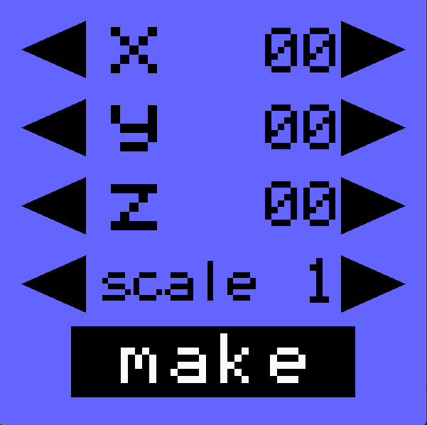
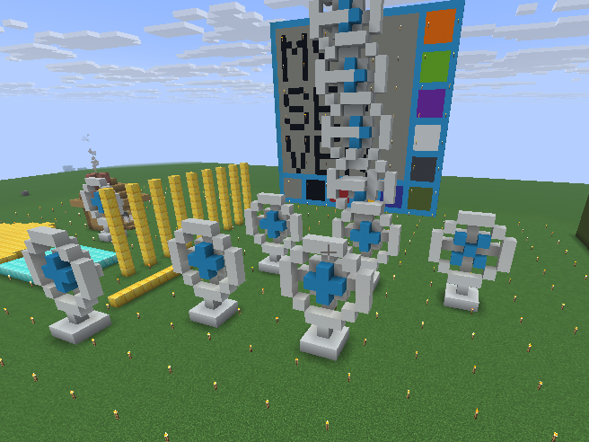

## minecraft_remote_senpuuki  千尋

### 扇風機をつくる

---

# 説明
### pygameを使って、扇風機をつくることにプラスして大きさや作る位置を変えれるようにする

---

## 数値を変えている様子
<video controls src="suuti.mp4" title="Title"></video>

--

## pygameの画面

--

## 数値について
### 座標はPLAYER_ORIGINとY_SEAを基準に作られ、プラス・マイナス50までの範囲、scaleは1~3の範囲で設定できる

---

## 実際に作ってみる!
